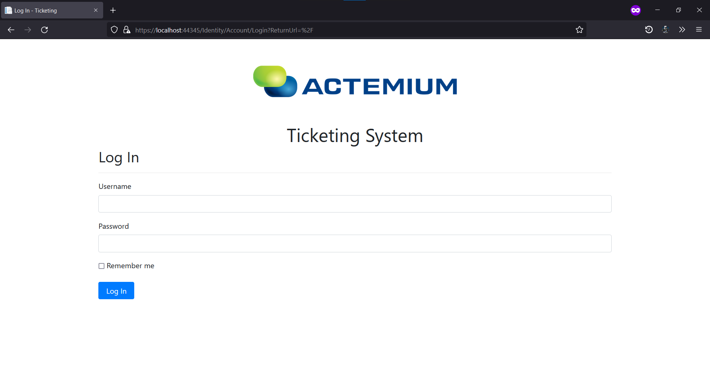
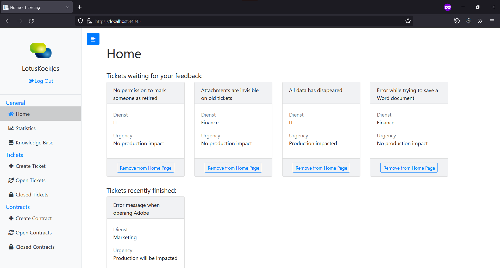
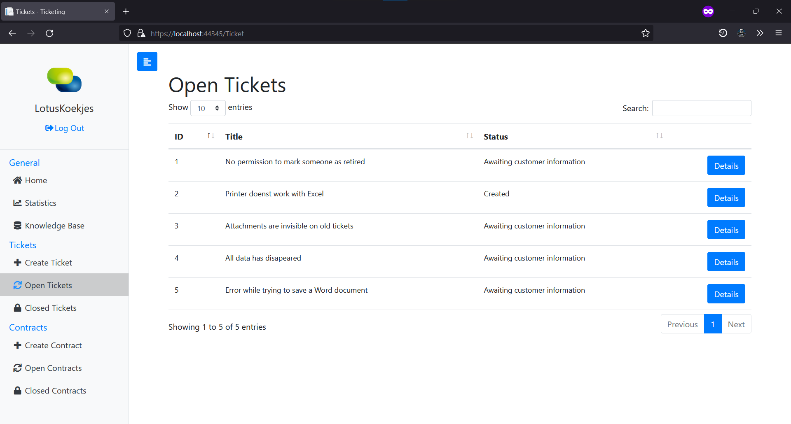
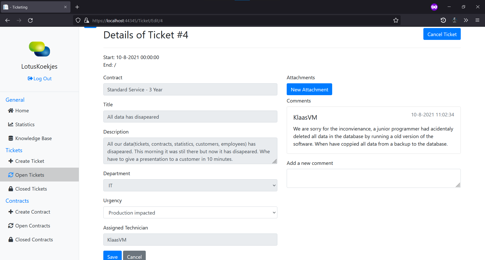
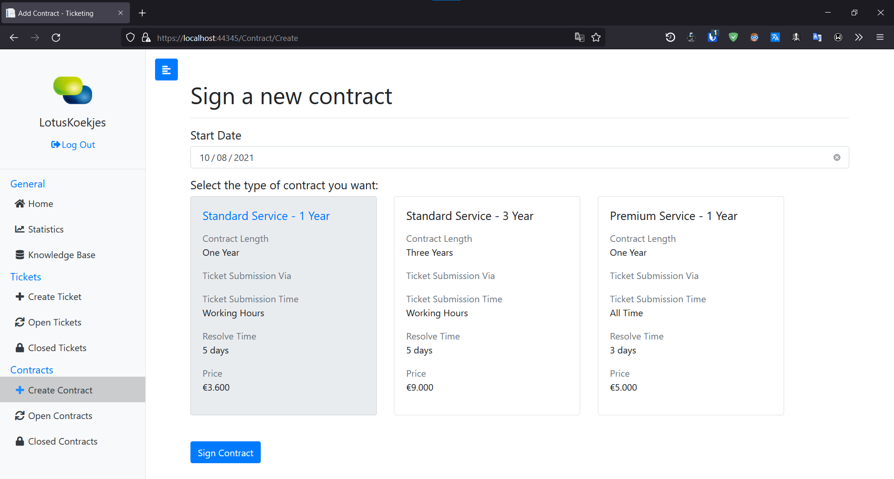
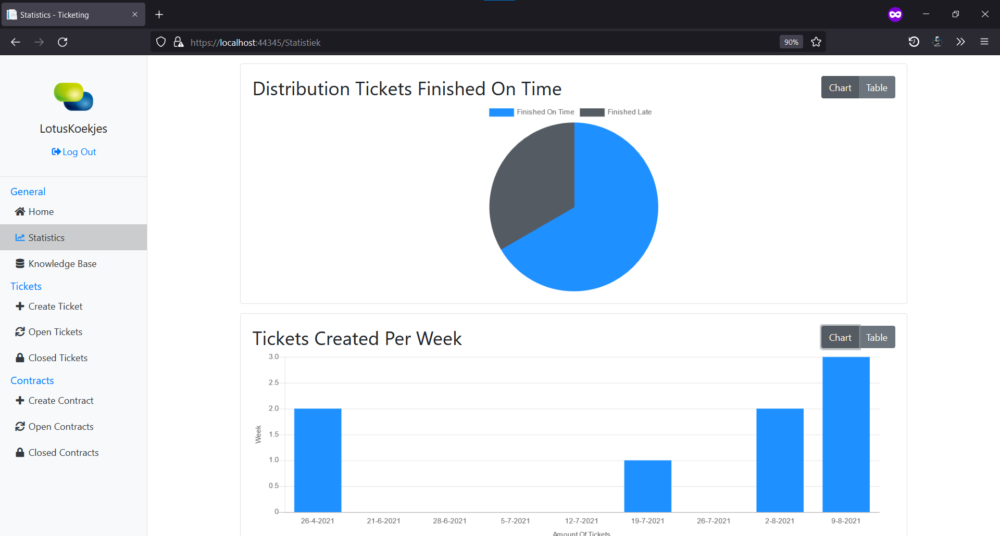
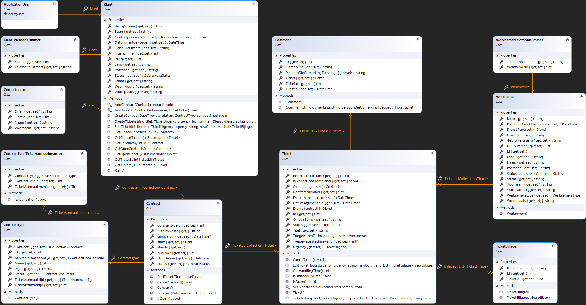
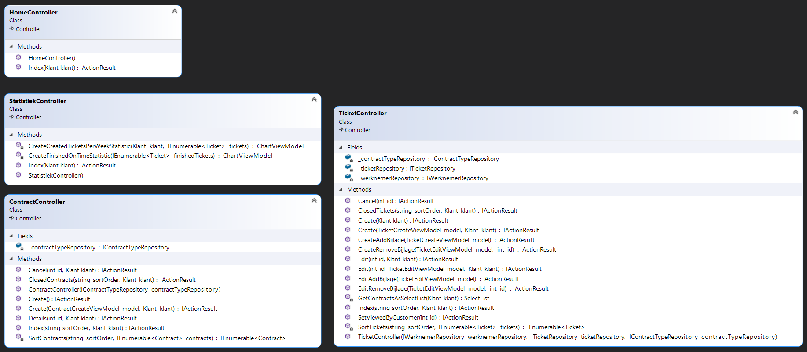
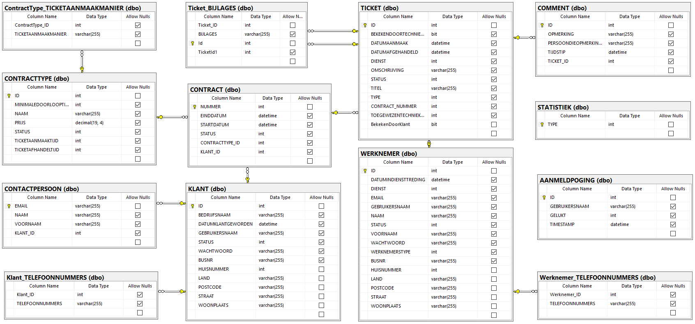

# HoGent-TicketingWebApp

A project made for the course Projecten-workshops II at HoGent. The goal was to design and code a web application in C# for managing tickets.

## Logins

| Username     | Pasword    | Contents       |
| :----------- | :--------- | :------------- |
| LotusKoekjes | Wachtwoord | Full customer  |
| JanDeNul     | Wachtwoord | Empty customer |

## Screenshots

## DCD Domain

## DCD Controllers

## ERD

